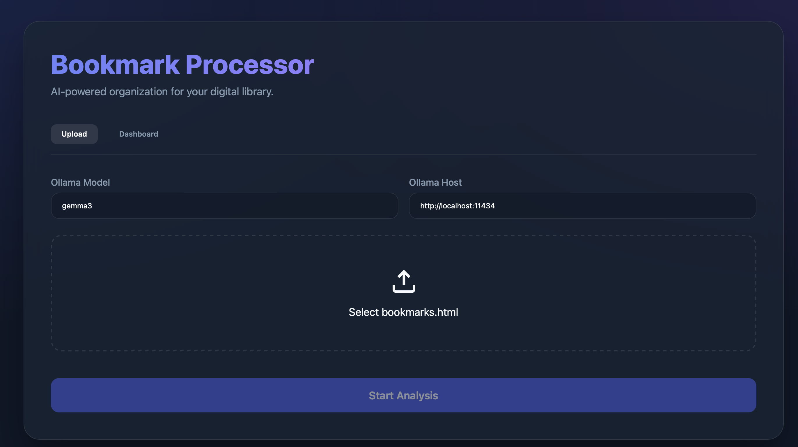
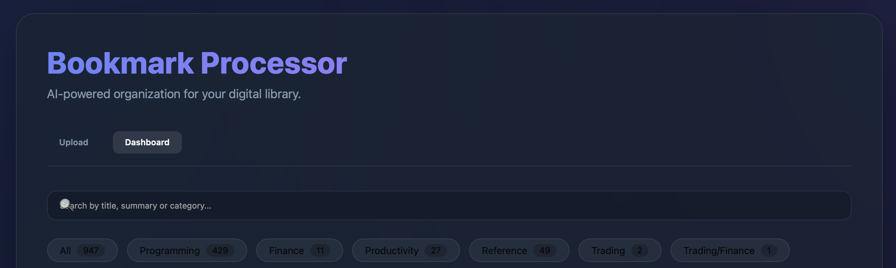

# Bookmark Processor & AI Summarizer

A modern web application to process Safari bookmarks, generate AI summaries using local LLMs (Ollama), and store them in a Supabase database.

## �️ Screenshots

### Upload View


### Dashboard View


## �🚀 Features
- **Modern Dashboard**: Browse your bookmarks in a responsive, searchable grid.
- **Categorization & Filtering**: Filter by keyword (title/summary) or click category pills for summary counts.
- **Interactive Cards**: Click the **Title** to open the link in a new tab; click the **Card** to toggle the full AI summary.
- **File Upload**: Upload `bookmarks.html` directly via a web interface with real-time progress tracking.
- **Local AI**: AI summaries generated locally using Ollama (default: `gemma3`).
- **Supabase Integration**: Persistent storage for titles, URLs, summaries, and categories.
- **Sleek Aesthetic**: High-quality glassmorphism design with React and Vanilla CSS.

## 🛠️ Tech Stack
- **Backend**: FastAPI (Python)
- **Frontend**: React + Vite (JS)
- **AI**: Ollama (Local)
- **Database**: Supabase (PostgreSQL)

## 📖 Quick Start

### 1. Configure Environment
Ensure `.env` in the root has your credentials:
```env
SUPABASE_URL=your_url
SUPABASE_KEY=your_key
```

### 2. Start Backend
```bash
python3 api/app.py
```

### 3. Start Frontend
```bash
cd frontend
npm install
npm run dev
```
Visit **http://localhost:5173** to start.

## 🔗 Project Structure
- `api/app.py`: FastAPI backend implementation.
- `frontend/`: React application.
- `main.py`: Original CLI tool implementation.
- `*.py`: Supporting logic for parsing, fetching, and LLM processing.

